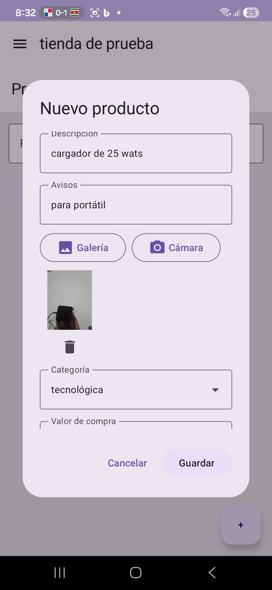
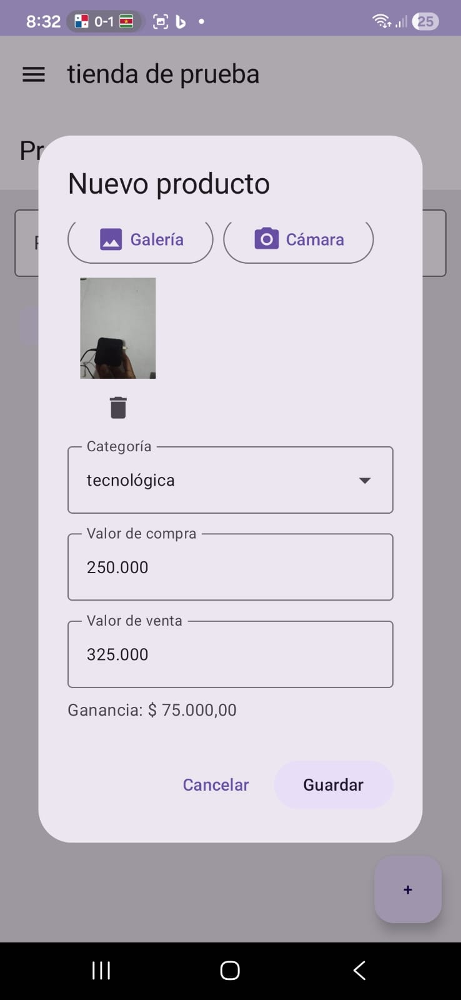

# tiendaRopa (MyKiosko) 🛍️
App Android para micro-negocios (tiendas de barrio y emprendimientos de ropa/calzado) que simplifica **inventario, ventas y gastos**, funciona **sin conexión** y permite **respaldar datos en ZIP**.

## ✨ Funcionalidad clave
- **Inventario**: de los prodcutos con precio de la compra y la venta para cualcular tu ganancia de cada prodcuto.
- **Ventas**: registro rápido y notas/observaciones.
- **Gastos**: categorías y filtros por fecha.
- **comprobantes**: la app genera un comprobante de la compra y abonos en PNG para compartirlo con los clientes.
- **Exportación de datos**: genera un **.zip** con **CSV por tabla** (todos los datos).
  > Nota: por ahora **las fotos no se incluyen en el respaldo**; se añadirán en una próxima versión.
- **Seguridad**: PIN/biometría (según hardware).
- **Local-first**: base local (Room/SQLite).

## 🧩 Stack técnico
- Kotlin + Jetpack Compose (Material 3)
- Room (SQLite) • MVVM + Use Cases

## 📸 Capturas

  
  <em>Menú de inicio con KPIs diarios</em>
  
  

  
  <em>En este menú se puede configurar el acceso a la con pin o lector de huella ademas de generar el ZIP con el respaldo de datos</em>
  
  

  
  
  
  <em>Este comprobante se genera en PNG y se puede compartir con los clientes</em>

## 🚀 Estado
**MVP funcional**. Próximos pasos: incluir fotos en respaldo ZIP y añadir mas idiomas (por ahora solo en ingles y español) y mas monedas (por ahora solo COP).
## 🔒 Privacidad
Los datos se almacenan en el dispositivo del usuario (no se envían a servidores).

## 👤 Autor
Jhon Sebastian Díaz Villa — Ingeniero en formacion de Sistemas y Telecomunicaciones, U. de Manizales  
Contacto: jhonsebastian-04@hotmail.com / jsdiaz99823@umanizales.edu.co

